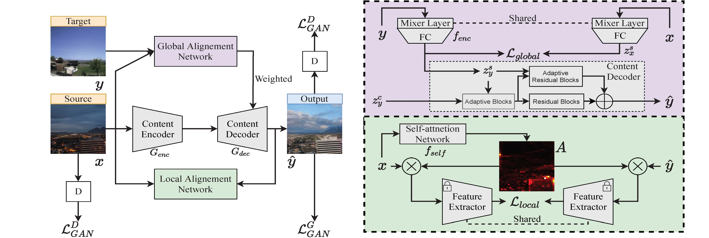
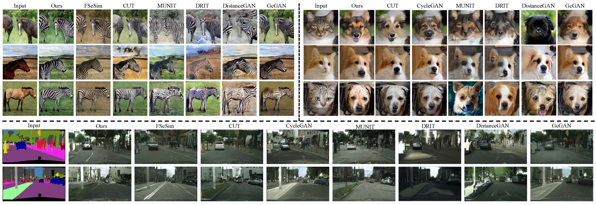

# GLANet
The code for Global and Local Alignment Networks for Unpaired Image-to-Image Translation [arxiv]()

Framework:

visualization results: 

## Getting Started
### Installation
This code was tested with Pytorch 1.7.0, CUDA 10.2, and Python 3.7

- Install Pytoch 1.7.0, torchvision, and other dependencies from [http://pytorch.org](http://pytorch.org)
- Install python libraries [visdom](https://github.com/facebookresearch/visdom) and [dominate](https://github.com/Knio/dominate) for visualization

```
pip install visdom dominate
```
- Clone this repo:

```
git clone https://github.com/ygjwd12345/GLANet.git
cd GLANet
```

### [Datasets](https://github.com/taesungp/contrastive-unpaired-translation/blob/master/docs/datasets.md)
Please refer to the original [CUT](https://github.com/taesungp/contrastive-unpaired-translation) and [CycleGAN](https://github.com/junyanz/pytorch-CycleGAN-and-pix2pix) to download datasets and learn how to create your own datasets.
```
    sh ./datasets/download_cyclegan_dataset.sh a2b
```
Available datasets are: apple2orange, summer2winter_yosemite, horse2zebra, monet2photo, cezanne2photo, ukiyoe2photo, vangogh2photo, maps, facades, iphone2dslr_flower, ae_photos
```
    sh ./datasets/download_pix2pix_dataset.sh xx
```
Available datasets are night2day, edges2handbags, edges2shoes, facades, maps

The Cityscapes dataset can be downloaded from https://cityscapes-dataset.com. After that, use the script ./datasets/prepare_cityscapes_dataset.py to prepare the dataset.
### Training

- Train the *single-modal* I2I translation model. Please check **run.sh**.
For instance:

```
python train.py  \
--dataroot ./datasets/summer2winter \
--name summer2winter \
--model sc \
--gpu_ids 0 \
--lambda_spatial 10 \
--lambda_gradient 0 \
--attn_layers 4,7,9 \
--loss_mode cos \
--gan_mode lsgan \
--display_port 8093 \
--direction BtoA \
--patch_size 64
```
  
### Testing

- Test the FID score for all training epochs, please also check **run.sh**.
For instance:
```
python test_fid.py \
--dataroot ./datasets/horse2zebra \
--checkpoints_dir ./checkpoints \
--name horse2zebra \
--gpu_ids 0 \
--model sc \
--num_test 0
```

- Test the KID, cityscape score, D&C, LPIPS, please check **run_dc_lpips.sh** in evaluations folder.
For instance:
```
python PerceptualSimilarity/lpips_2dirs.py -d0 /data2/gyang/TAGAN/results/summer2winter-F64-mixer/test_350/images/real_B -d1 /data2/gyang/TAGAN/results/summer2winter-F64-mixer/test_350/images/fake_B -o ./example_dists.txt --use_gpu
python3 segment.py test -d ./datasets/cityscapes -c 19 --arch drn_d_22 \
    --pretrained ./drn_d_22_cityscapes.pth --phase val --batch-size 1
```

## Acknowledge
Our code is developed based on [FSeSim](https://github.com/lyndonzheng/F-LSeSim) and[unguided](https://github.com/mvrl/un_guided). We also thank [pytorch-fid](https://github.com/mseitzer/pytorch-fid) for FID computation,  [LPIPS](https://github.com/richzhang/PerceptualSimilarity) for diversity score, and [D&C](https://github.com/clovaai/generative-evaluation-prdc) for density and coverage evaluation.


